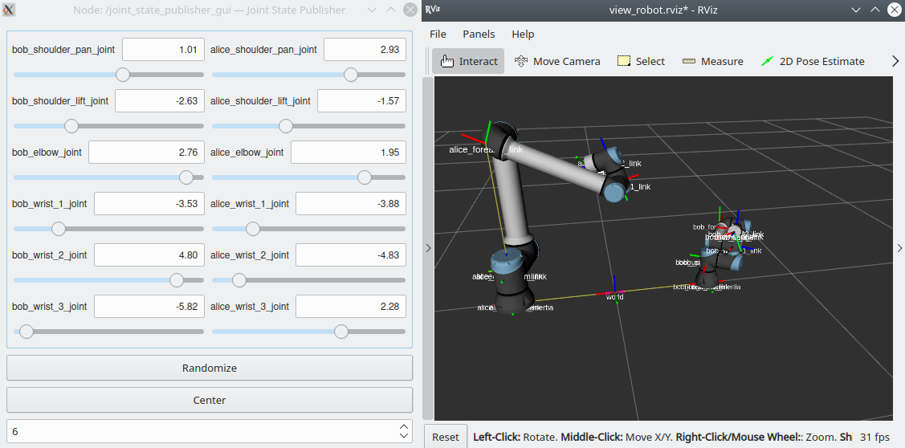
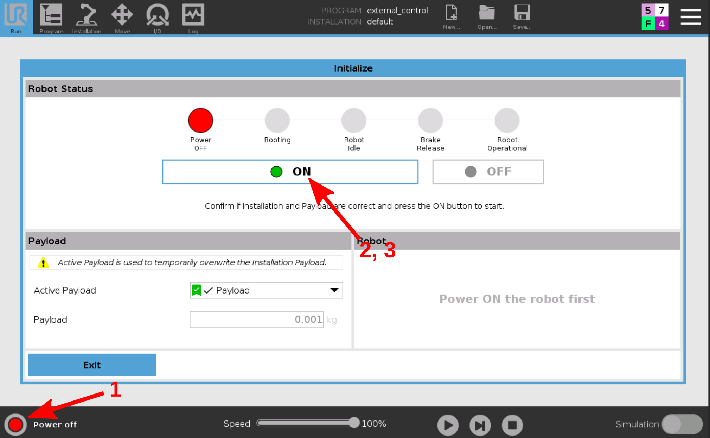
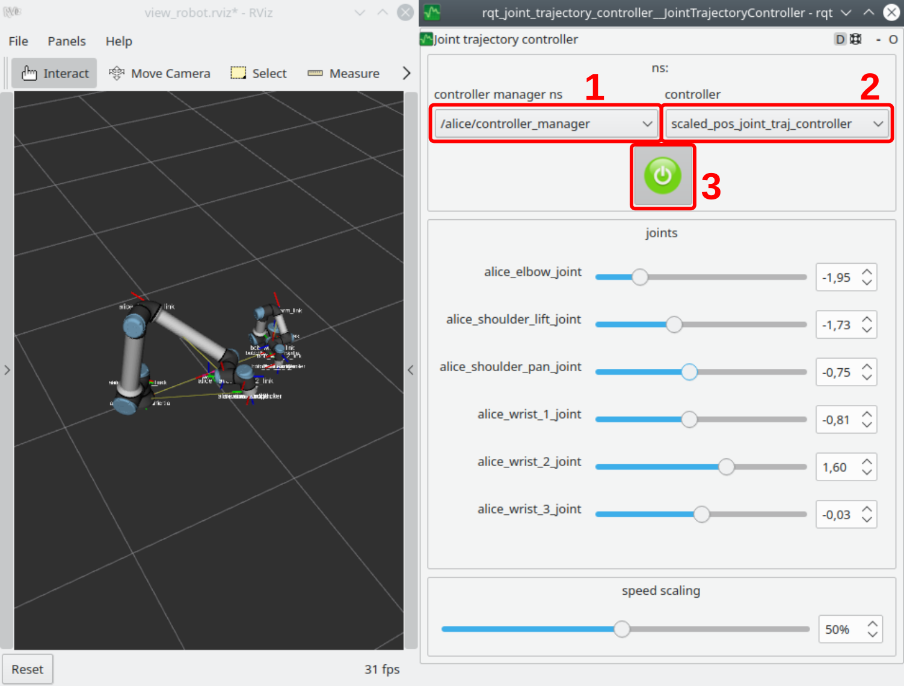

Step by step explanation of a dual-robot setup
==============================================

This chapter explains all the steps necessary to create a dual-arm setup using the
``ur_robot_driver``.

In order to create a multi-robot workcell we basically have to consider three aspects:

* When integrating multiple robots into one *robot_description* we face one challenge: We can't have
  multiple *tf* frames with the same name, e.g. ``base_link`` in the same *robot_description*.
  Therefore, we'll have to use prefixes.
* Once the robot description uses tf prefixes, the joint names will also use those prefixes.
  Therefore, we'll need to adapt our robot controllers that they are defined on those "modified"
  joint names.
* As we will be starting multiple instances of the same ROS nodes, we'll have to take care that
  their names (nodes, topics, services) do not collide. One easy way to achieve this is using ROS
  namespaces

Assembling the URDF
-------------------

The ur_description_ package provides `macro files <https://github.com/ros-industrial/universal_robot/blob/melodic-devel/ur_description/urdf/inc/ur5e_macro.xacro>`_ to generate an instance of a Universal Robots arm. We'll use this to assemble a description containing a Box with a UR3e and a UR10e ontop:

.. literalinclude:: ../../../../../ur_example_dual_robot/urdf/dual_robot.xacro
   :language: xml
   :linenos:
   :caption: ur_example_dual_robot/urdf/dual_robot.xacro

Let's break it down:

First, we'll have to **include** the macros to generate the two arms:

.. literalinclude:: ../../../../../ur_example_dual_robot/urdf/dual_robot.xacro
   :language: xml
   :lineno-start: 4
   :lines: 4,5
   :linenos:
   :caption: ur_example_dual_robot/urdf/dual_robot.xacro

The two include lines only loaded the macro for generating robots. Next, we can call the macros to
actually **create the arms**.

.. literalinclude:: ../../../../../ur_example_dual_robot/urdf/dual_robot.xacro
   :language: xml
   :lineno-start: 8
   :lines: 8,9
   :linenos:
   :caption: ur_example_dual_robot/urdf/dual_robot.xacro

This creates the two robots ``alice`` and ``bob``. We choose their names as a tf-prefix in order to
make the link and joint names unique. Note the trailing underscore in the prefixes, as the prefixes
will be added in front of the link and joint names without adding a further underscore.

The last thing to do is **connecting** the two robots to our common ``world`` link by adding two fixed
joints.

.. literalinclude:: ../../../../../ur_example_dual_robot/urdf/dual_robot.xacro
   :language: xml
   :lineno-start: 15
   :lines: 15-24
   :linenos:
   :caption: ur_example_dual_robot/urdf/dual_robot.xacro

We can view our custom workcell by running

.. code-block:: bash

   roslaunch ur_example_dual_robot view_dual_robot.launch

Use the sliders of the joint_state_publisher_gui to move the virtual robots around. It should look
something like this:

Define controller configuration files for the two robots
--------------------------------------------------------

In the last paragraph we created a description containing both robots. To avoid name clashes, both
robots got a prefix ``alice_`` and ``bob_`` respectively.

For using the ``ur_robot_driver`` with this description we'll have to make sure that we load
controllers containing the joint names **with** the prefixes.

To keep things simple, we'll copy the controller configuration from the ``ur_robot_driver`` and only
rename the joints inside. The following listing shows how that could be achieved, if you cloned this
repo you will already have the corresponding files.

.. code-block:: bash

   cd <src-location-of-ur_example_dual_robot>
   mkdir -p etc
   roscp ur_robot_driver ur10e_controllers.yaml etc/alice_controllers.yaml
   roscp ur_robot_driver ur3e_controllers.yaml etc/bob_controllers.yaml

With a text editor, we open the files and change the joint names that they contain the prefixes

.. literalinclude:: ../../../../../ur_example_dual_robot/etc/alice_controllers.yaml
   :language: yaml
   :lineno-start: 5
   :lines: 5-13
   :linenos:
   :caption: ur_example_dual_robot/etc/alice_controllers.yaml

.. literalinclude:: ../../../../../ur_example_dual_robot/etc/bob_controllers.yaml
   :language: yaml
   :lineno-start: 5
   :lines: 5-13
   :linenos:
   :caption: ur_example_dual_robot/etc/bob_controllers.yaml

Create a launchfile and start drivers for both robots
-----------------------------------------------------

Now we have everything in place to startup two driver instances for *alice* and *bob*. The
``ur_robot_driver`` offers different levels of abstractions inside its launchfiles. Basically, we
need the following components:

#. load the description
#. Driver for *alice*
#. Driver for *bob*
#. robot_state_publisher(s?)

First of all, loading the description can be done straight-forward:

.. literalinclude:: ../../../../../ur_example_dual_robot/launch/dual_robot_startup.launch
   :language: xml
   :lineno-start: 24
   :lines: 24-27
   :linenos:
   :caption: ur_example_dual_robot/launch/dual_robot_startup

If you want, ignore the two arguments passed to this launchfile for now. See
:ref:`bonus_calibration` for details.

To start the drivers we again need to watch out for name clashes. Both drivers start the same
controllers which are using the same topics to communicate. To avoid clashes, we will start each
driver in a separate namespace. We use the ``ur_control.launch`` launchfile from ``ur_robot_driver``
for that:

.. literalinclude:: ../../../../../ur_example_dual_robot/launch/dual_robot_startup.launch
   :language: xml
   :lineno-start: 29
   :lines: 29-44
   :linenos:
   :caption: ur_example_dual_robot/launch/dual_robot_startup

With this, each robot will have its ``joint_state_controller`` running inside its namespace, meaning
that the ``joint_states`` topic will be inside the respecive namespaces, namely
``/alice/joint_states`` and ``/bob/joint_states``. Therefore, we start a ``robot_state_publisher``
(that will convert ``joint_states`` messages into TF messages to produce up-to-date poses of each
link). This could also be done differently, e.g. by having one ``robot_state_publisher`` in the
top-level namespace and adding a joint_state_publisher_ that collects the two topics from their
namespaces into ``/joint_states``. If you wish to have a ``/joint_states`` topic, you might want to
take that route.

Run the demo
------------

Now, we've got everyting together to actually run the full demo. For running the demo you will need
a working Docker setup as explained in the :ref:`examples_installation`.

For startup you'll need two shells: One for starting two simulated robots using docker + ursim and
one for the ROS components.

In the first shell execute

.. code-block:: bash

   rosrun ur_example_dual_robot docker_alice_bob.sh

This will use docker-compose to start two docker containers running a simulated robot.
Wait, until the robots are started up. You can connect to the robots using their web interface:

* Alice: `http://10.5.0.5:6080/vnc.html <http://10.5.0.5:6080/vnc.html>`_
* Bob: `http://10.5.0.6:6080/vnc.html <http://10.5.0.6:6080/vnc.html>`_

Once the robots have booted, start them as you would with a normal robot using the red button in the
lower left corner:

When the robots have booted, start the driver instances as follows

.. code-block:: bash

   roslaunch ur_example_dual_robot dual_robot_startup.launch

This should startup the drivers, an RViz instance and an rqt_joint_trajectory_controller window.

The last thing we need to do is to start the ``external_control`` program on the robots. They have
the respective URCap already installed and a program created and loaded. Simply press the play
button on each robot to start external control from ROS.
In the shell running the drivers, you should now see ``Robot connected to reverse interface.
Ready to receive control commands.`` twice.

Using the rqt_joint_trajectory_controller window you can select one of the robots (1), select the
controller to use (2, it should just be one) click on the big red button (3, it will turn green as
shown in the image) and then use the sliders to move the robots around.

.. _bonus_calibration:

Bonus: Use correct robot calibration with dual_robot setup
----------------------------------------------------------

.. _ur_description: https://github.com/ros-industrial/universal_robot/tree/melodic-devel/ur_description
.. _joint_state_publisher: http://wiki.ros.org/joint_state_publisher#Subscribing_JointState_messages
