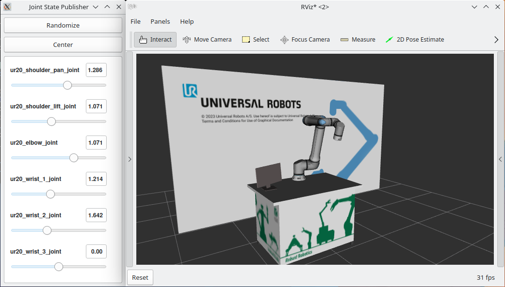

===================
Assembling the URDF
===================

The `ur_description <https://github.com/UniversalRobots/Universal_Robots_ROS2_Description>`_ package provides `macro files <https://github.com/UniversalRobots/Universal_Robots_ROS2_Description/blob/rolling/urdf/ur_macro.xacro>`_ to generate an instance of a Universal Robots arm.
We'll use this to create a custom workcell with a ur20 inside: 

.. literalinclude:: ../../../../../my_robot_cell/my_robot_cell_description/urdf/my_robot_cell.urdf.xacro
    :language: xml
    :linenos:
    :caption: my_robot_cell_description/urdf/my_robot_cell.urdf.xacro

Let's break it down:

First, we'll have to **include** the macro to generate the robot arm:

.. literalinclude:: ../../../../../my_robot_cell/my_robot_cell_description/urdf/my_robot_cell.urdf.xacro
    :language: xml
    :start-at:   <xacro:include filename="$(find ur_description)/urdf/ur_macro.xacro"/>
    :end-at:   <xacro:include filename="$(find ur_description)/urdf/ur_macro.xacro"/>
    :linenos:
    :caption: my_robot_cell_description/urdf/my_robot_cell.urdf.xacro

The second **include** contains our costum workspace:

.. literalinclude:: ../../../../../my_robot_cell/my_robot_cell_description/urdf/my_robot_cell.urdf.xacro
    :language: xml
    :start-at:     <xacro:include filename="$(find my_robot_cell_description)/urdf/my_robot_cell_macro.xacro"/>
    :end-at:     <xacro:include filename="$(find my_robot_cell_description)/urdf/my_robot_cell_macro.xacro"/>
    :linenos:
    :caption: my_robot_cell_description/urdf/my_robot_cell.urdf.xacro

Those lines only loadeded the macros for generating the robot and the workcell.

Later, we will call the macro to create the arm. Therefore, we need to declare certain arguments that must be passed to the macro.

.. literalinclude:: ../../../../../my_robot_cell/my_robot_cell_description/urdf/my_robot_cell.urdf.xacro
    :language: xml
    :start-at:   <xacro:arg name="ur_type" default="ur20"/>
    :end-at:     <xacro:arg name="visual_params" default="$(find ur_description)/config/$(arg ur_type)/visual_parameters.yaml"/>
    :linenos:
    :caption: my_robot_cell_description/urdf/my_robot_cell.urdf.xacro
    
The macro we are calling now contains all items within the workcell that are not part of the robot arm. If you are not experienced in writing URDFs, you may want to refer to this  `tutorial <https://docs.ros.org/en/rolling/Tutorials/Intermediate/URDF/URDF-Main.html>`_.

.. literalinclude:: ../../../../../my_robot_cell/my_robot_cell_description/urdf/my_robot_cell.urdf.xacro
    :language: xml
    :start-at:     <xacro:my_robot_cell/>
    :end-at:       <xacro:my_robot_cell/>
    :linenos:
    :caption: my_robot_cell_description/urdf/my_robot_cell.urdf.xacro

The loaded macro is defined in the following manner:

.. literalinclude:: ../../../../../my_robot_cell/my_robot_cell_description/urdf/my_robot_cell_macro.xacro
    :language: xml
    :linenos: 
    :caption: my_robot_cell_description/urdf/my_robot_cell_macro.urdf.xacro

This macro provides an example of what a custom workcell could resemble. Your workspace will likely vary from this one. Please feel free to modify this portion of the URDF to match your own setup. In this instance, our workspace comprises a table in front of a wall, featuring a monitor, and the **ur20** robot arm mounted on top.

Ensure that your custom workcell includes the parent link, which must be passed to the **ur_robot** macro. In this example, we chose to create a link named **robot_mount**.

.. literalinclude:: ../../../../../my_robot_cell/my_robot_cell_description/urdf/my_robot_cell_macro.xacro
    :language: xml
    :start-at: <link name="robot_mount"/>
    :end-before:   </xacro:macro>
    :linenos: 
    :caption: my_robot_cell_description/urdf/my_robot_cell.urdf.xacro

After that we are finally able to actually **create the robot arm** by calling the macro. 

.. literalinclude:: ../../../../../my_robot_cell/my_robot_cell_description/urdf/my_robot_cell.urdf.xacro
    :language: xml
    :start-at:   <xacro:ur_robot
    :end-at:   </xacro:ur_robot>
    :linenos: 
    :caption: my_robot_cell_description/urdf/my_robot_cell.urdf.xacro

Note that the **origin** argument is transmitted in a different manner than the other arguments.

Before we can test our code, it's essential to build and source our Colcon workspace:

.. code-block:: bash

    #cd to your colcon workspace root
    cd ~/colcon_ws

    #source and build your workspace
    colcon build
    source install/setup.bash

We can view our custom workspace by running:

.. code-block:: bash

    #launch rviz
    ros2 launch my_robot_cell_description view_workspace.launch.py

Use the sliders of the ``joint_state_puplisher_gui`` to move the virtual robot around.
It should look something like this:

    