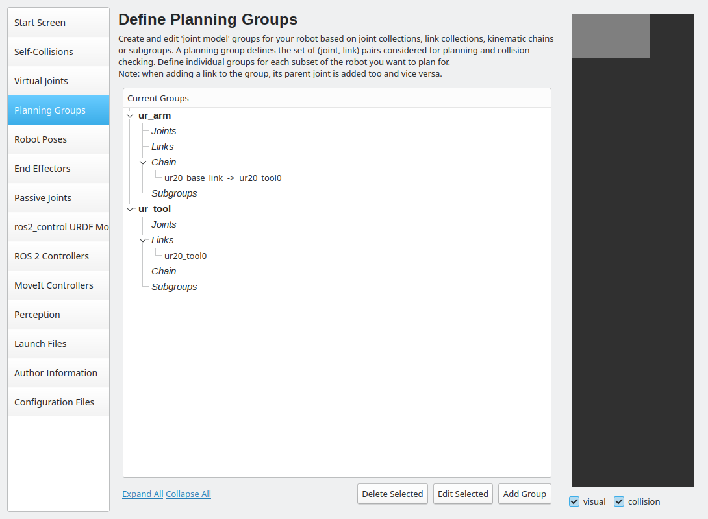

========================
Build the MoveIt! config
========================

At this point, you should be able to run the ``ur_robot_driver`` for your custom UR setup.
Now, we are only one last step away from actually planning and executing trajectories.

To utilize MoveIt 2 for this purpose, which will handle trajectory planning for us, we need to set up a MoveIt configuration package.
To create such a **MoveIt configuration package**, MoveIt provides a very useful Setup Assistant.

We can start the MoveIt Setup Assistant by running:

.. code-block:: bash

    ros2 launch moveit_setup_assistant setup_assistant.launch.py

Please note that MoveIt itself provides a detailed `tutorial <https://moveit.picknik.ai/main/doc/examples/setup_assistant/setup_assistant_tutorial.html?highlight=setup%20assistant>`_ on how to use the Setup Assistant, so you may want to go through that.
Although the Setup Assistant is very straightforward, there are some tips and tricks we want to discuss in the following sections.

The first task the MoveIt Setup Assistant asks us to do is to load the URDF with the optional xacro arguments. Most of the arguments we declared already have the correct default values and can be ignored at this stage. 
However, one argument you might want to change from their default values is **ur_type**. So, **Step 1** might look something like this:

Another step that differs from the `MoveIt tutorial <https://moveit.picknik.ai/main/doc/examples/setup_assistant/setup_assistant_tutorial.html?highlight=setup%20assistant>`_ is **Step 4**. Two useful planning groups we should add are the **ur_arm** itself and the **ur_tool** as an end effector. The tutorial asks us to add each individual joint to the arm planning group.
A more reasonable and error-resistant approach is to define it as a kinematic chain in the following manner:

We can add the end effector planning group in the same way the tutorial recommends. Your planning groups should look something like this:

Since we've already determined which ROS 2 controllers we want to use to start the ``ur_robot_driver``, we don't need the Setup Assistant to generate a ros2_control.yaml file. Therefore, we can skip **Step 9: ROS 2 Controllers** and **Step 10: MoveIt Controllers** for now. 

In **Step 12**, the Setup Assistant asks us to select which launch files we need. To maintain clarity, we should only generate those that are essential for our purpose.
For our specific use case, we only need the **RViz Launch**, **MoveGroup Launch** and the **setup assistant Launch**.

After **Step 14**, where we generated the MoveIt Config, we need to manually assemble the MoveIt controllers. To do this, we must create a .yaml file called "moveit_controllers.yaml" in the config directory of the package.
The file specifies which controller MoveIt uses for its trajectory planning and could look something like this:

.. literalinclude:: ../../../../../my_robot_cell/my_robot_cell_moveit_config/config/moveit_controllers.yaml
    :language: yaml
    :linenos:
    :caption: my_robot_cell_moveit_config/config/moveit_controllers.yaml

In our example MoveIt uses the scaled_joint_trajectory_controller.

Now you are ready to use moveit with an actual **ur20**, moveit itself also provides you with the oportunity to start a robot with mock hardware. To do that our **moveit config** needs some adjustments.
First you need to create a few more launch Files in **Step 12**. To start mock hardware we also need the **Robot State Publisher Launch**, the **Spwan Controllers Launch** and the **Demo Launch**.

When using real hardware, the ``ur_robot_driver`` spawns the ros2 controllers for us. However, if we want MoveIt to initiate a mock hardware setup, MoveIt needs to launch the ROS 2 controllers instead.
Consequently, we must generate a "ros2_controllers.yaml" file for this purpose. Such a **ros2_controllers.yaml** could look something like this:

.. literalinclude:: ../../../../../my_robot_cell/my_robot_cell_moveit_config/config/ros2_controllers.yaml
    :language: yaml
    :linenos:
    :caption: my_robot_cell_moveit_config/config/ros2_controllers.yaml

Before we can test our code, it's essential to build and source our Colcon workspace:

.. code-block:: bash

    #cd to your colcon workspace root
    cd ~/colcon_ws

    #source and build your workspace
    colcon build
    source install/setup.bash

With all that we can finally start trajectory planning. After we made sure that the ``ur_robot_driver`` is still running we can start MoveIt.
We can start the move_group node by running the launch file the setup assitant created for us:

.. code-block:: bash

    ros2 launch my_robot_cell_moveit_config move_group.launch.py

If everything went well you should see the output: **"You can start planning now!"**.

You can simply try it out by launching the RViz node and planning some trajectories directly through the GUI.

.. code-block:: bash

    ros2 launch my_robot_cell_moveit_config moveit_rviz.launch.py

To start moveit with mock hardware you can simply use:

.. code-block:: bash

    ros2 launch my_robot_cell_moveit_config demo.launch.py

