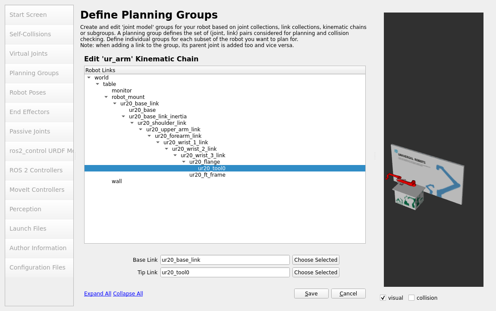

========================
Build the MoveIt! config
========================

At this point, you should be able to run the ``ur_robot_driver`` for your custom UR setup.
Now, we are only one last step away from actually planning and executing trajectories.

To utilize MoveIt! 2 for this purpose, which will handle trajectory planning for us, we need to set up a MoveIt! configuration package.
To create such a **MoveIt! configuration package**, MoveIt! provides a very useful Setup Assistant.

Setup Assistant
---------------

We can start the MoveIt! Setup Assistant by running:

.. code-block:: bash

   ros2 launch moveit_setup_assistant setup_assistant.launch.py

Please note that MoveIt! itself provides a detailed `tutorial <https://moveit.picknik.ai/main/doc/examples/setup_assistant/setup_assistant_tutorial.html?highlight=setup%20assistant>`_ on how to use the Setup Assistant, so you may want to go through that.
Although the Setup Assistant is very straightforward, there are some tips and tricks we want to discuss in the following sections.

The first task the MoveIt! Setup Assistant asks us to do is to load the URDF with the optional xacro arguments. If you would like to change the ``ur_type`` for example, you could also specify that here. For this demonstration we'll go with our description's default values.

Next, make sure that the generated **self-collisions** are detected correctly. In our example the robot
is positioned on the table in such a way, that it collides with the monitor on the table when all
joints are in the 0 position. Hence, the collision is allowed as "Collision by default". We remove
that tick, since we don't want that collision to be ignored.

.. image:: self_collisions.png
   :alt: Adjust self-collisions - Remove the tick for the collsion between monitor and ur20_upper_arm_link.

We skip adding virtual joints for now and continue with our **planning group(s)**.
We add a planning group called **ur_arm**. A reasonable and error-resistant approach is to define
it as a kinematic chain in the following manner:

Your planning groups should look something like this:

.. image:: planning_groups.png
   :alt: Planning Groups

We'll skip setting up ros2_control related points, since we've already configured that in our
control package.

In the **MoveIt Controllers** step we setup our desired controller to match the name
"scaled_joint_trajectory_controller":

We skip **perception** as we don't have any cameras setup in our scenario.

In the next step we modify the **launch files** being generated by the assistant. We only generate
"RViz Launch and Config", "MoveGroup Launch" and "Setup Assistant Launch". The other launch files
are for starting a demo using mock hardware, which would basically be a duplication of what we
already did in our control package. Since we also do not use the Warehouse feature for now, we also
skip that file.

.. image:: launch_files.png
   :alt: Select the launch files to be generated

After the **Author information** we select which configuration files to generate. Again, we strip
down all the files needed for mock hardware startup.

.. image:: config_files.png
   :alt: Select the config files to be generated

With all the information entered, you can **generate** the package and close the setup assistant.

Manual adaptions
----------------

Before we can actually use our package we have to adapt the joint limits. Since MoveIt! requires
joint acceleration limits to be specified but the description doesn't contain those, we need to
specify these inside the generated ``config/joint_limits.yaml`` file.

They are not part of the arm's description since there are no physical acceleration limits, as
those are highly dependent on the robot's current pose and TCP force (e.g. induced by the weight
carried at the TCP). Setting the acceleration limits to ``5.0`` for all joints should be a
conservative value. Higher values might lead to unwanted slowdowns during execution or even
protective stops, while lower values will result in slower motions due to slow ramp-up and
ramp-down parts of the trajectory.

.. literalinclude:: ../../../../../my_robot_cell/my_robot_cell_moveit_config/config/joint_limits.yaml
   :language: yaml
   :linenos:
   :caption: my_robot_cell_moveit_config/config/joint_limits.yaml

Please note that you could also change the default velocity and acceleration scaling in this file.
Also, if you want to specify any limits (position or velocity) that differ from your description, you
can set them here. Remember that does will only be used for planning trajectories, not necessarily
for execution. If you send trajectories from another source than MoveIt! those limits will not
apply!

Usage
-----

Before we can test our code, it's essential to build and source our Colcon workspace:

.. code-block:: bash

   #cd to your colcon workspace root
   cd ~/colcon_ws

   #source and build your workspace
   colcon build
   source install/setup.bash

Now you are ready to use MoveIt! with an actual **ur20**, MoveIt! itself also provides you with the opportunity to start a robot with mock hardware.

To startup the complete system, you'll have to start three launch files in three individual
terminals.

First, we need to start a robot, simulated or real. If you start a real robot, make sure that the
*external_control* program is active on the robot.

.. code-block:: bash

   # You can switch to real hardware if you prefer
   ros2 launch my_robot_cell_control start_robot.launch.py use_mock_hardware:=true

Second, we can start the move_group node by running the launch file the setup assistant created for us:

.. code-block:: bash

    ros2 launch my_robot_cell_moveit_config move_group.launch.py

If everything went well you should see the output: **"You can start planning now!"**.

To interact with the MoveIt! setup, you can start RViz with the correct setup file:

.. code-block:: bash

    ros2 launch my_robot_cell_moveit_config moveit_rviz.launch.py

From that setup you can start developing your application involving a custom move_group interface
or similar. Please refer to the MoveIt! documentation for further reading.
